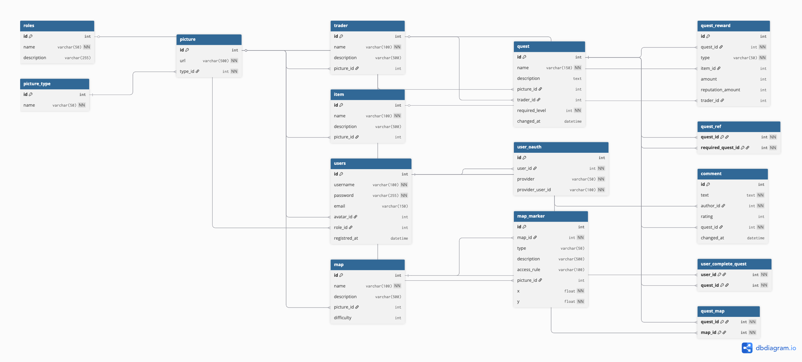

# Лабораторная работа 2. Генератор данных.

База данных для сайта помощи игрокам в Escape from Tarkov. 
Сайт решает две гланые проблемы:

1. Навигация в игре, интерактивные карты;
2. Получение информации о выполнении квестов и отслеживание прогресса.

Модель бд:



Генерация данных описана в файле `seed.rs` в функции `seeds_generate`. По сути вставки с рандомными данными в таблицу. Связи таблиц поддерживаются по количеству вставленных записей. 

## Сборка и запуск

Раcчитывается, что все скрипты будут выполнены из корня.

Сборка:
```rust
./build.sh
```

Запуск:
```rust
./lab2/run.sh
```