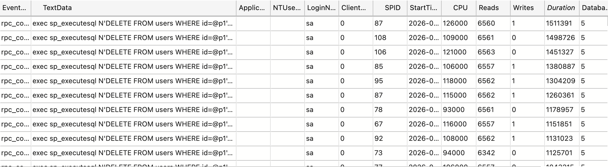
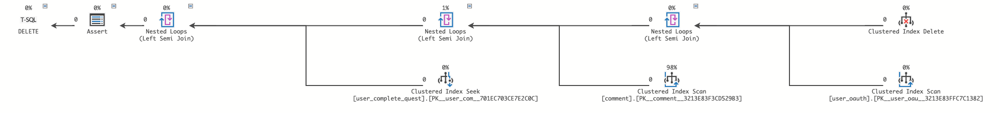
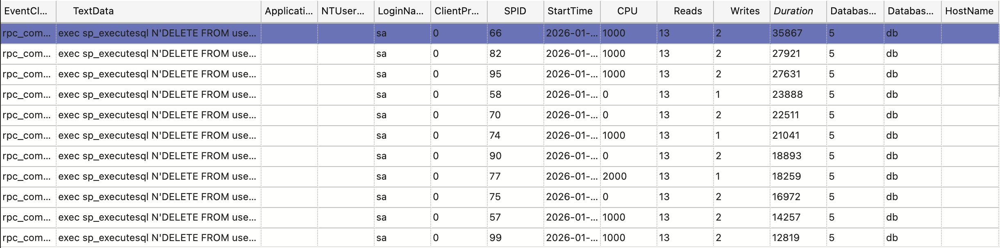
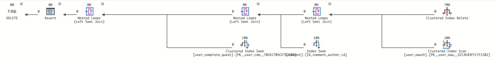
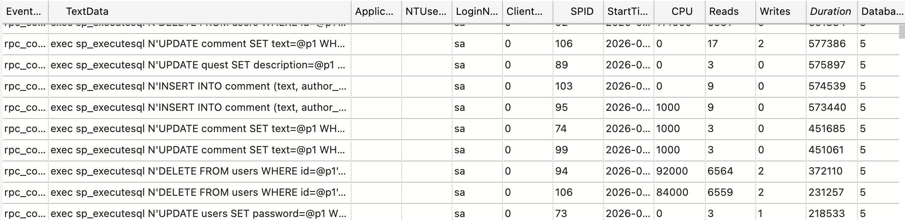
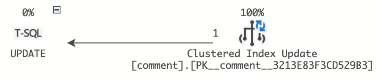
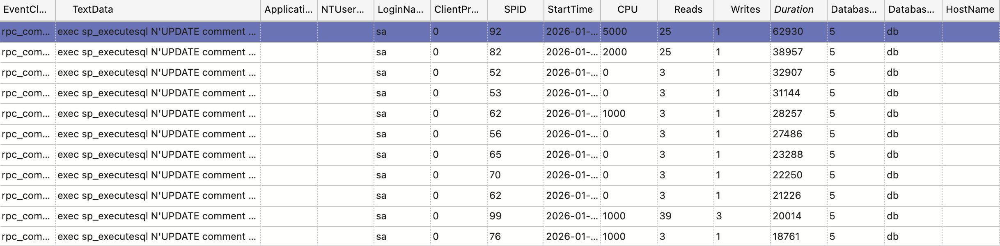

# Лабораторная работа 3. Мониторинг сервера баз данных. Оптимизация запросов.

Моделирование деятельности пользователя в файле `simulation.rs`, несколько пользователь создаются через ассинхронные задачи в `main.rs`.

Генерируется число от 1 до 100, к промежуткам внутри этого промежутка привзяанны определенные запросы, чтение чаще чем вставка и удаление.

## Мониторинг с помощью SQL Profiler.

2 самых требовательных запроса:

1. Удаление пользователя.



`exec sp_executesql N'DELETE FROM users WHERE id=@p1',N'@p1 int',@p1=268783`

- CPU: 126000;
- Duration: 1511391;
- page_server_reads: 0;
- physical_reads: 0;
- Reads: 6560;
- Writes: 1;
- result: 0;
- row_count: 1;
- connection_reset_option: 0.

План выполнения:

```sql
DECLARE @p1 int = 84328;

DELETE FROM users 
WHERE id = @p1;
```


Profiler сам предлагает решение:
> Missing Index (Impact 99.3606): CREATE NONCLUSTERED INDEX [<Name of Missing Index，sysname,>] ON [dbo].[comment] ([author_id])

Cоздаем некластеризованный индекс: 
```sql
CREATE NONCLUSTERED INDEX IX_comment_author_id 
ON comment (author_id);
```

Результат:

Судя по количеству символов во времени выполнения запроса, скорость выполнения увеличалась в ~100раз.

Новый план выполнния:


2. Обновление комментария:



`exec sp_executesql N'UPDATE comment SET text=@p1 WHERE id=@p2',N'@p1 nvarchar(340),@p2 int',@p1=N'et et vitae aut iste omnis laborum velit. voluptatem optio ad labore harum soluta velit. expedita illum blanditiis cumque. minus labore dolores ipsa voluptas nobis animi.',@p2=114637`

- CPU: 0;
- Duration: 577386;
- page_server_reads: 0;
- physical_reads: 0;
- Reads: 17;
- Writes: 2;
- result: 0;
- row_count: 1;
- connection_reset_option: 0.

План выполнения: 

```sql
DECLARE @p1 nvarchar(340) = 
N'et et vitae aut iste omnis laborum velit. voluptatem optio ad labore harum soluta velit. expedita illum blanditiis cumque. minus labore dolores ipsa voluptas nobis animi.';
DECLARE @p2 int = 114637;

UPDATE comment 
SET text = @p1 
WHERE id = @p2;
```


Проблема решилась решение из пункта 1. Результат:

Судя по количеству символов во времени выполнения запроса, скорость выполнения увеличалась в ~10раз.

План выполения не изменился.


## Черновой вариант без SQL Profiler. Это придумал чатик.

Раcчитывается, что все скрипты будут выполнены из корня.

Сборка:
```rust
./build.sh
```

Запуск:
```rust
./lab2/run.sh
./lab2/run.profiler.sh
./lab2/db.sh
```